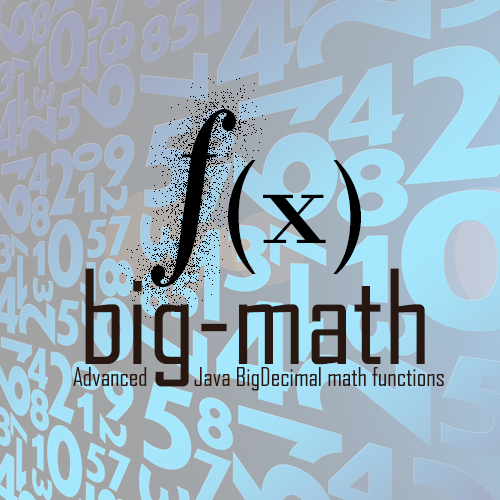
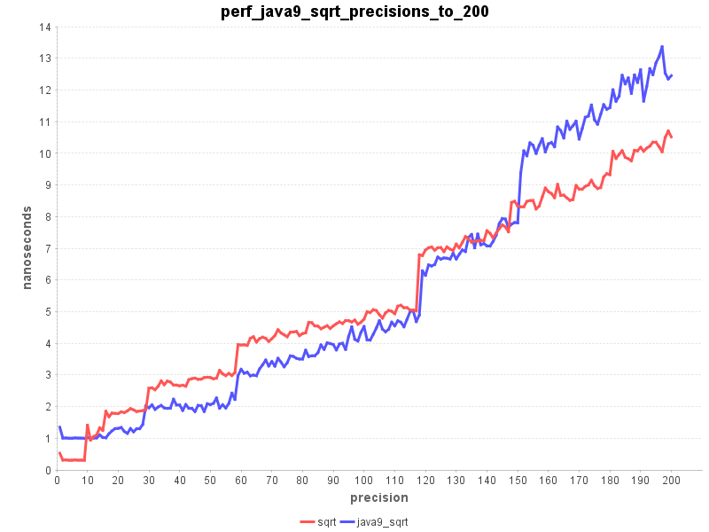
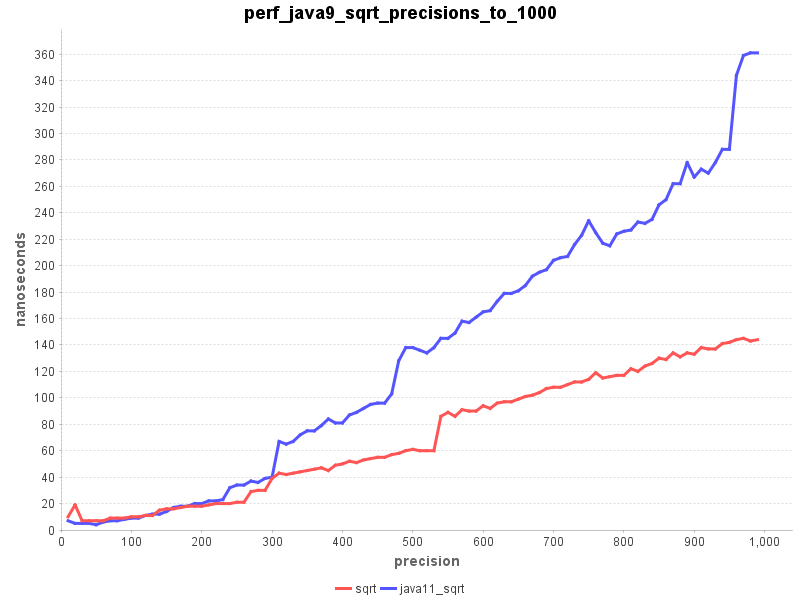
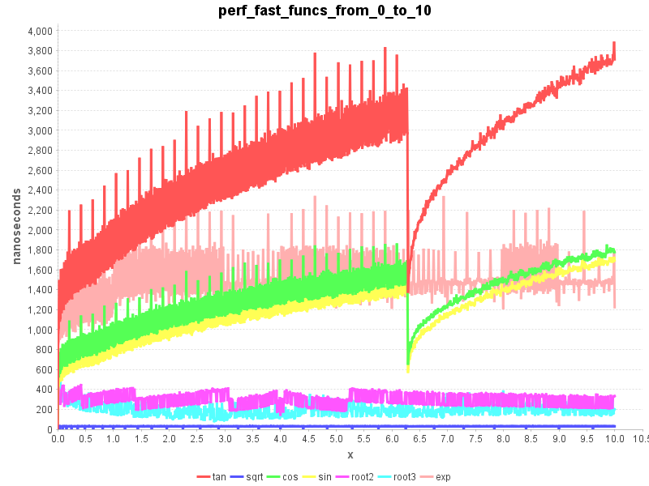
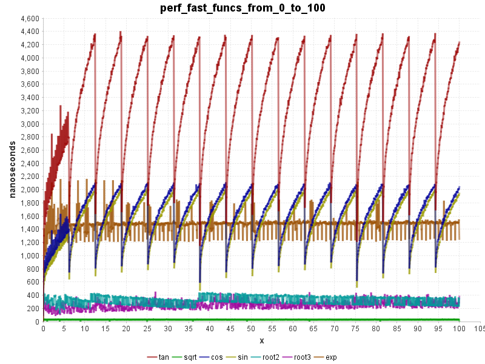
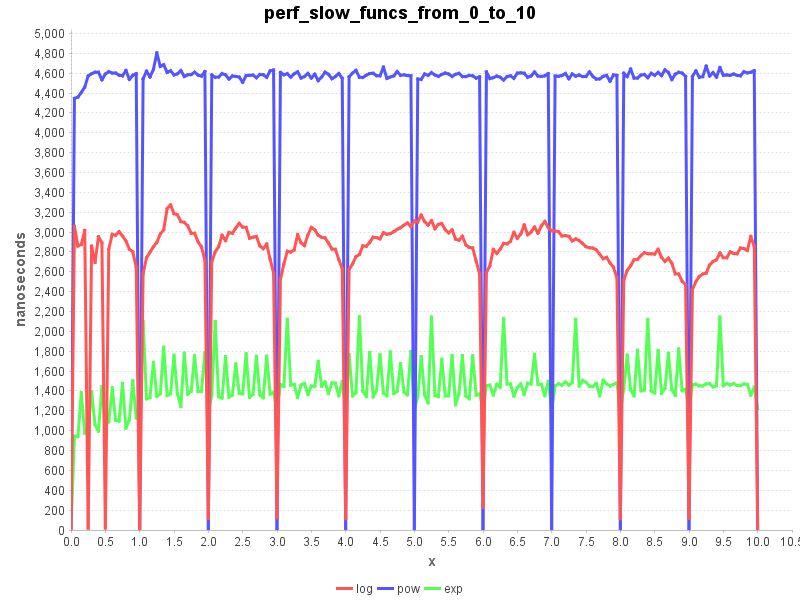
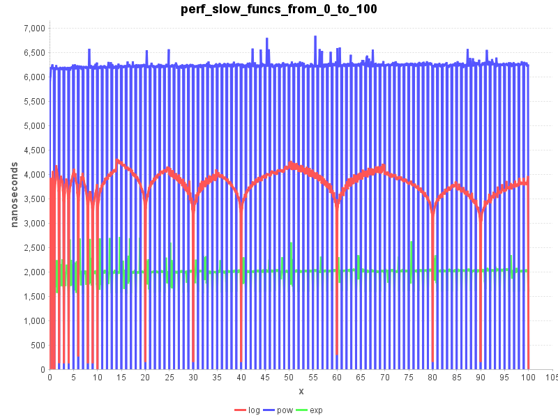

[](https://travis-ci.org/eobermuhlner/big-math)
[](https://codecov.io/gh/eobermuhlner/big-math)
[](https://search.maven.org/artifact/ch.obermuhlner/big-math)

<p align="center">
	
</p>

Advanced Java `BigDecimal` math functions (`pow`, `sqrt`, `log`, `sin`, ...) using arbitrary precision.

See also the official [Big-Math Documentation](http://eobermuhlner.github.io/big-math/).

## BigDecimalMath

The class `BigDecimalMath` provides efficient and accurate implementations for:

*   `log(BigDecimal, MathContext)`
*   `exp(BigDecimal, MathContext)`
*   `pow(BigDecimal, BigDecimal, MathContext)` calculates x^y
*   `sqrt(BigDecimal, BigDecimal, MathContext)`
*   `root(BigDecimal, BigDecimal, MathContext)` calculates the n'th root of x
*   `sin(BigDecimal, MathContext)`
*   `cos(BigDecimal, MathContext)`
*   `tan(BigDecimal, MathContext)`
*   `asin(BigDecimal, MathContext)`
*   `acos(BigDecimal, MathContext)`
*   `atan(BigDecimal, MathContext)`
*   `atan2(BigDecimal, BigDecimal, MathContext)`
*   `sinh(BigDecimal, MathContext)`
*   `cosh(BigDecimal, MathContext)`
*   `tanh(BigDecimal, MathContext)`
*   `asinh(BigDecimal, MathContext)`
*   `acosh(BigDecimal, MathContext)`
*   `atanh(BigDecimal, MathContext)`
*   `pow(BigDecimal, long, MathContext)` calculates x^y for `long` y
*   `factorial(int)` calculates n!
*   `bernoulli(int)` calculates Bernoulli numbers
*   `pi(MathContext)` calculates pi to an arbitrary precision
*   `e(MathContext)` calculates e to an arbitrary precision
*   `mantissa(BigDecimal)` extracts the mantissa from a `BigDecimal` (mantissa * 10^exponent)
*   `exponent(BigDecimal)` extracts the exponent from a `BigDecimal` (mantissa * 10^exponent)
*   `integralPart(BigDecimal)` extracts the integral part from a `BigDecimal` (everything before the decimal point) 
*   `fractionalPart(BigDecimal)` extracts the fractional part from a `BigDecimal` (everything after the decimal point)
*   `isIntValue(BigDecimal)` checks whether the `BigDecimal` can be represented as an `int` value
*   `isDoubleValue(BigDecimal)` checks whether the `BigDecimal` can be represented as a `double` value
*   `roundWithTrailingZeroes(BigDecimal, MathContext)` rounds a `BigDecimal` to an arbitrary precision with trailing zeroes.


### Usage

#### Mathematical calculations for `BigDecimal`

For calculations with arbitrary precision you need to specify how precise you want a calculated result.
For `BigDecimal` calculations this is done using the `MathContext`.

```java
MathContext mathContext = new MathContext(100);
System.out.println("sqrt(2)        = " + BigDecimalMath.sqrt(BigDecimal.valueOf(2), mathContext));
System.out.println("log10(2)       = " + BigDecimalMath.log10(BigDecimal.valueOf(2), mathContext));
System.out.println("exp(2)         = " + BigDecimalMath.exp(BigDecimal.valueOf(2), mathContext));
System.out.println("sin(2)         = " + BigDecimalMath.sin(BigDecimal.valueOf(2), mathContext));
```
will produce the following output on the console:
```
sqrt(2)        = 1.414213562373095048801688724209698078569671875376948073176679737990732478462107038850387534327641573
log10(2)       = 0.3010299956639811952137388947244930267681898814621085413104274611271081892744245094869272521181861720
exp(2)         = 7.389056098930650227230427460575007813180315570551847324087127822522573796079057763384312485079121795
sin(2)         = 0.9092974268256816953960198659117448427022549714478902683789730115309673015407835446201266889249593803
```

Since many mathematical constants have an infinite number of digits you need to specfiy the desired precision for them as well:
```java
MathContext mathContext = new MathContext(100);
System.out.println("pi             = " + BigDecimalMath.pi(mathContext));
System.out.println("e              = " + BigDecimalMath.e(mathContext));
```
will produce the following output on the console:
```
pi             = 3.141592653589793238462643383279502884197169399375105820974944592307816406286208998628034825342117068
e              = 2.718281828459045235360287471352662497757247093699959574966967627724076630353547594571382178525166427
```

#### Convenience methods for `BigDecimal`

Additional `BigDecimalMath` provides several useful methods (that are plain missing for `BigDecimal`):
```java
MathContext mathContext = new MathContext(100);
System.out.println("mantissa(1.456E99)      = " + BigDecimalMath.mantissa(BigDecimal.valueOf(1.456E99)));
System.out.println("exponent(1.456E99)      = " + BigDecimalMath.exponent(BigDecimal.valueOf(1.456E99)));
System.out.println("integralPart(123.456)   = " + BigDecimalMath.integralPart(BigDecimal.valueOf(123.456)));
System.out.println("fractionalPart(123.456) = " + BigDecimalMath.fractionalPart(BigDecimal.valueOf(123.456)));
System.out.println("isIntValue(123)         = " + BigDecimalMath.isIntValue(BigDecimal.valueOf(123)));
System.out.println("isIntValue(123.456)     = " + BigDecimalMath.isIntValue(BigDecimal.valueOf(123.456)));
System.out.println("isDoubleValue(123.456)  = " + BigDecimalMath.isDoubleValue(BigDecimal.valueOf(123.456)));
System.out.println("isDoubleValue(1.23E999) = " + BigDecimalMath.isDoubleValue(new BigDecimal("1.23E999")));
```
will produce the following output on the console:
```
mantissa(1.456E99)      = 1.456
exponent(1.456E99)      = 99
integralPart(123.456)   = 123
fractionalPart(123.456) = 0.456
isIntValue(123)         = true
isIntValue(123.456)     = false
isDoubleValue(123.456)  = true
isDoubleValue(1.23E999) = false
```

#### Streams of `BigDecimal`

The class `BigDecimalStream` provides factory methods for streams of `BigDecimal` elements.

Overloaded variants of `range(start, end, step)` provide sequential elements equivalent to `IntStream.range(start, end)` but with configurable step (exclusive the end value).

Similar methods for the `rangeClosed()` (inclusive the end value) are available.

The streams are well behaved when used in parallel mode. 

The following code snippet:
```java
System.out.println("Range [0, 10) step 1 (using BigDecimal as input parameters)");
BigDecimalStream.range(BigDecimal.valueOf(0), BigDecimal.valueOf(10), BigDecimal.valueOf(1), mathContext)
	.forEach(System.out::println);

System.out.println("Range [0, 10) step 3 (using long as input parameters)");
BigDecimalStream.range(0, 10, 3, mathContext)
	.forEach(System.out::println);
```

produces this output:
```
Range [0, 10) step 1 (using BigDecimal as input parameters)
0
1
2
3
4
5
6
7
8
9

Range [0, 12] step 3 (using long as input parameters)
0
3
6
9
12
```

### FAQ

#### Why do I have to pass `MathContext` to most functions?

Many mathematical functions have results that have many digits (often an infinite number of digits).
When calculating these functions you need to specify the number of digits you need, because calculating an infinite number of digits would take literally forever and consume an infinite amount of memory.

The `MathContext` contains a precision and information on how to round the last digits, so it is an obvious choice to specify the desired precision of mathematical functions.

#### What if I really do not want to pass the `MathContext` everytime?

The convenience class `DefaultBigDecimalMath` was added that provides mathematical functions
where the `MathContext` must not be passed every time.

The class `DefaultBigDecimalMath` is a wrapper around `BigDecimalMath` that passes always the same default `MathContext` to the
functions that need a `MathContext` argument.

It is possible to control the default `MathContext` programmatically, or specify it at start time using system properties.

#### I specified a precision of `n` digits, but the results have completely different number of digits after the decimal point. Why?

It is a common misconception that the precision defines the number of digits after the decimal point.

Instead the precision defines the number of relevant digits, independent of the decimal point.
The following numbers all have a precision of 3 digits:
* 12300
* 1230
* 123
* 12.3
* 1.23
* 0.123
* 0.0123

To specify the number of digits after the decimal point use `BigDecimal.setScale(scale, mathContext)`.

#### Why are `BigDecimalMath` functions so slow?

The mathematical functions in `BigDecimalMath` are heavily optimized to calculate the result in the specified precision, but in order to calculate them often tens or even hundreds of basic operations (+, -, *, /) using `BigDecimal` are necessary.

If the calculation of your function is too slow for your purpose you should verify whether you really need the full precision in your particular use case. Sometimes you can adapt the precision depending on input factors of your calculation.

#### How are the mathematical functions in `BigDecimalMath` calculated?

For the mathematical background and performance analysis please refer to this article:
*	[BigDecimalMath](http://obermuhlner.ch/wordpress/2016/06/02/bigdecimalmath/)

Some of the implementation details are explained here: 
*	[Adaptive precision in Newton’s Method](http://obermuhlner.ch/wordpress/2016/06/07/adaptive-precision-in-newtons-method/)

#### I only need a `sqrt` function - should I use this library?

With Java 9 the `BigDecimal` class has a new function `sqrt(BigDecimal, MathContext)`.
If you only need the square root function then by all means use the provided standard function instead of this library.

If you need any other high level function then you should still consider using this library.

For high precision (above 150 digits) the current implementation of
Java 9 `BigDecimal.sqrt()` becomes increasingly slower than `BigDecimalMath.sqrt()`.
You should consider whether the increased performance is worth having an additional dependency.  

The following charts shows the time needed to calculate the square root of 3.1 with increasing precision.





### Performance

The following charts show the time needed to calculate the functions over a range of values with a precision of 300 digits.








## BigComplex

The class `BigComplex` represents complex numbers in the form `(a + bi)`.
It follows the design of `BigDecimal` with some convenience improvements like overloaded operator methods.

A big difference to `BigDecimal` is that `BigComplex.equals()` implements the *mathematical* equality
and *not* the strict technical equality.
This was a difficult decision because it means that `BigComplex` behaves slightly different than `BigDecimal`
but considering that the strange equality of `BigDecimal` is a major source of bugs we
decided it was worth the slight inconsistency.

If you need the strict equality use `BigComplex.strictEquals()`.

* `re`
* `im`
* `add(BigComplex)`
* `add(BigComplex, MathContext)`
* `add(BigDecimal)`
* `add(BigDecimal, MathContext)`
* `add(double)`
* `subtract(BigComplex)`
* `subtract(BigComplex, MathContext)`
* `subtract(BigDecimal)`
* `subtract(BigDecimal, MathContext)`
* `subtract(double)`
* `multiply(BigComplex)`
* `multiply(BigComplex, MathContext)`
* `multiply(BigDecimal)`
* `multiply(BigDecimal, MathContext)`
* `multiply(double)`
* `divide(BigComplex)`
* `divide(BigComplex, MathContext)`
* `divide(BigDecimal)`
* `divide(BigDecimal, MathContext)`
* `divide(double)`
* `reciprocal(MathContext)`
* `conjugate()`
* `negate()`
* `abs(MathContext)`
* `angle(MathContext)`
* `absSquare(MathContext)`
* `isReal()`
* `re()`
* `im()`
* `round(MathContext)`
* `hashCode()`
* `equals(Object)`
* `strictEquals(Object)`
* `toString()`
* `valueOf(BigDecimal)`
* `valueOf(double)`
* `valueOf(BigDecimal, BigDecimal)`
* `valueOf(double, double)`
* `valueOfPolar(BigDecimal, BigDecimal, MathContext)`
* `valueOfPolar(double, double, MathContext`


## BigComplexMath

The class `BigComplexMath` is the equivalent of `BigDecimalMath` and contains mathematical functions in the complex domain.

* `sin(BigComplex, MathContext)` 
* `cos(BigComplex, MathContext)` 
* `tan(BigComplex, MathContext)` 
* `asin(BigComplex, MathContext)`
* `acos(BigComplex, MathContext)`
* `atan(BigComplex, MathContext)`
* `acot(BigComplex, MathContext)`
* `exp(BigComplex, MathContext)`
* `log(BigComplex, MathContext)`
* `pow(BigComplex, long, MathContext)` 
* `pow(BigComplex, BigDecimal, MathContext)` 
* `pow(BigComplex, BigComplex, MathContext)` 
* `sqrt(BigComplex, MathContext)` 
* `root(BigComplex, BigDecimal, MathContext)` 
* `root(BigComplex, BigComplex, MathContext)` 


## BigFloat

The class `BigFloat` is a wrapper around `BigDecimal` which simplifies the consistent usage of the `MathContext` and provides a simpler API for calculations. 

The API for calculations is simplified and more consistent with the typical mathematical usage.
* Factory methods on the `Context` class for values:
	* `valueOf(BigFloat)`
	* `valueOf(BigDecimal)`
	* `valueOf(int)`
	* `valueOf(long)`
	* `valueOf(double)`
	* `valueOf(String)`
	* `pi()`
	* `e()`

* All standard operators:
	* `add(x)`
	* `subtract(x)`
	* `multiply(x)`
	* `divide(x)`
	* `remainder(x)`
	* `pow(y)`
	* `root(y)`

* Calculation methods are overloaded for different value types:
 	* `add(BigFloat)`
	* `add(BigDecimal)`
	* `add(int)`
	* `add(long)`
	* `add(double)`
	* ...

* Mathematical functions are written in the traditional form:
 	* `abs(x)`
	* `log(x)`
	* `sin(x)`
	* `min(x1, x2, ...)`
	* `max(x1, x2, ...)`
	* ...

* Support for advanced mathematical functions:
 	* `sqrt(x)`
	* `log(x)`
	* `exp(x)`
	* `sin(x)`
	* `cos(x)`
	* `tan(x)`
	* ...

* Methods to access parts of a value:
 	* `getMantissa()`
	* `getExponent()`
	* `getIntegralPart()`
	* `getFractionalPart()`

* Methods to verify value type conversions:
 	* `isIntValue()`
 	* `isDoubleValue()`

* Equals and Hashcode methods:
	* `equals(Object)` returns whether two `BigFloat` values are mathematically the same
	* `hashCode()` consistent with `equals(Object)`

* Comparison methods:
 	* `isEqual(BigFloat)`
	* `isLessThan(BigFloat)`
	* `isLessThanOrEqual(BigFloat)`
	* `isGreaterThan(BigFloat)`
	* `isGreaterThanOrEqual(BigFloat)`

* Sign methods:
	* `signum()`
	* `isNegative()`
	* `isZero()`
	* `isPositive()`

### Usage

Before doing any calculations you need to create a `Context` specifying the precision used for all calculations.
```java
Context context = BigFloat.context(100); // precision of 100 digits
Context anotherContext = BigFloat.context(new MathContext(10, RoundingMode.HALF_UP); // precision of 10 digits, rounding half up
```

The `Context` can then be used to create the first value of the calculation:
```java
BigFloat value1 = context.valueOf(640320);
```

The `BigFloat` instance holds a reference to the `Context`. This context is then passed from calculation to calculation.
```java
BigFloat value2 = context.valueOf(640320).pow(3).divide(24);
BigFloat value3 = BigFloat.sin(value2);
```


The `BigFloat` result can be converted to other numerical types:
```java
BigDecimal bigDecimalValue = value3.toBigDecimal();
double doubleValue = value3.toDouble();
long longValue = value3.toLong();
int intValue = value3.toInt();
```

The `BigFloatStream` provides similar stream factories as `BigDecimalStream` that will produce streams of `BigFloat` elements.

### Usage in Java Module Systems (Jigsaw and OSGi)

Since release 2.0.1 the deployed big-math Jar file contains now a module name for the Jigsaw module system (Java 9 and later).

This allows it to be used as automatic module with a well defined module name instead
of deriving the name magically from the Jar file name.

The module name follows the reverse domain convention and is: `ch.obermuhlner.math.big`

The big-math Jar file is also OSGi compatible.

The `MANIFEST.MF` contains all the necessary headers and exports the public packages:
- `ch.obermuhlner.math.big`
- `ch.obermuhlner.math.big.stream`

### Usage in Kotlin

If you want to use big-math library in Kotlin you may do so directly, or you use the 
[kotlin-big-math](https://github.com/eobermuhlner/kotlin-big-math) library that provides additional features, like operators.


## Using big-math in your projects

To use the Java library you can either download the newest version of the .jar file from the
[published releases on Github](https://github.com/eobermuhlner/big-math/releases/)
or use the following dependency to
[Maven Central](https://search.maven.org/#search%7Cga%7C1%7Cbig-math)
in your build script (please verify the version number to be the newest release):

### Use big-math in Maven Build

```xml
<dependency>
    <groupId>ch.obermuhlner</groupId>
    <artifactId>big-math</artifactId>
    <version>2.0.0</version>
</dependency>
```

### Use big-math in Gradle Build

```gradle
repositories {
  mavenCentral()
}

dependencies {
  compile 'ch.obermuhlner:big-math:2.0.0'
}
```
