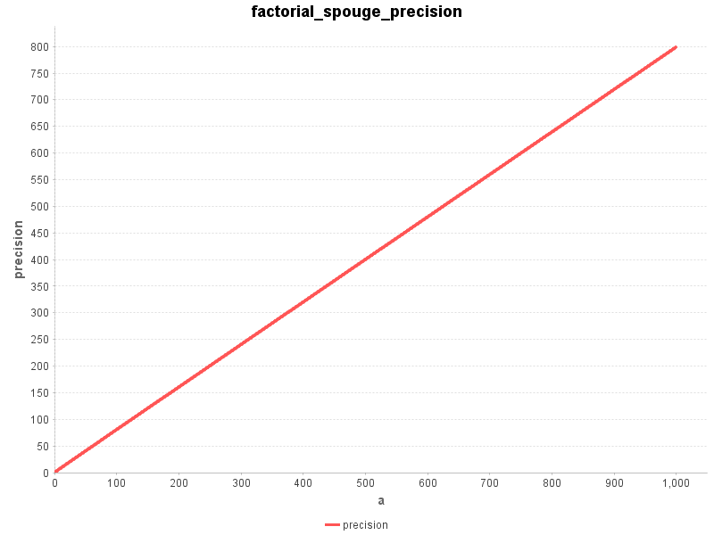
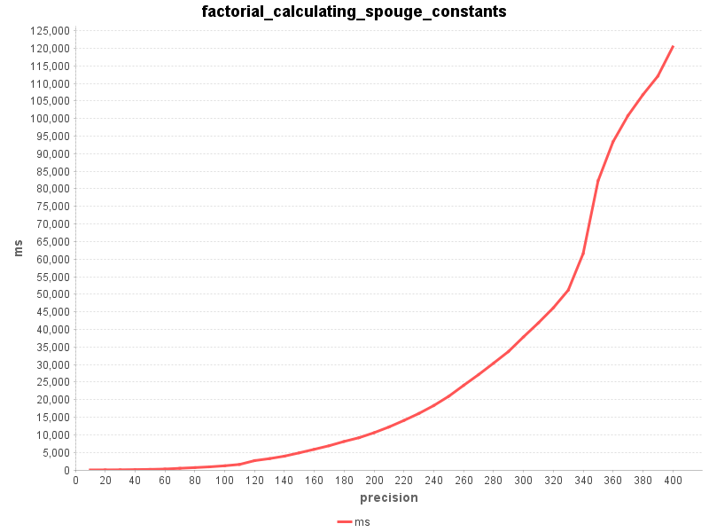
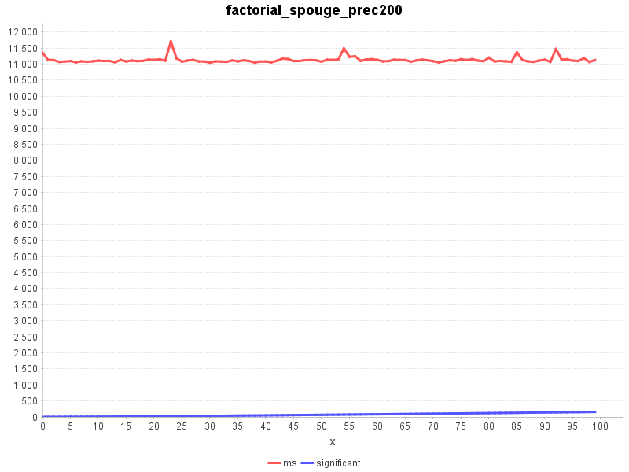
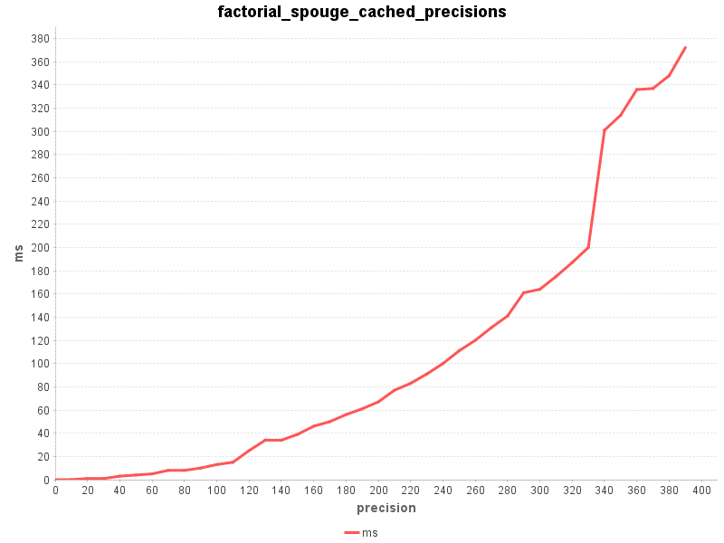

# Non-integer Factorial and Gamma function

## Introduction

This article describes how the factorial and Gamma functions for non-integer arguments where implemented for the 
[big-math](https://github.com/eobermuhlner/big-math)
library.

For an introduction into the Gamma function see 
[Wikipedia: Gamma Function](https://en.wikipedia.org/wiki/Gamma_function)

## Attempt to use Euler's definition as an infinite product


[Euler's infinite product definition](https://en.wikipedia.org/wiki/Gamma_function#Euler's_definition_as_an_infinite_product)
is easy to implement,
but I have some doubts about its usefulness to calculate the result with the desired precision. 


```java
	public static BigDecimal factorialUsingEuler(BigDecimal x, int steps, MathContext mathContext) {
		MathContext mc = new MathContext(mathContext.getPrecision() * 2, mathContext.getRoundingMode());

		BigDecimal product = BigDecimal.ONE;
		for (int n = 1; n < steps; n++) {
			BigDecimal factor = BigDecimal.ONE.divide(BigDecimal.ONE.add(x.divide(BigDecimal.valueOf(n), mc), mc), mc).multiply(pow(BigDecimal.ONE.add(BigDecimal.ONE.divide(BigDecimal.valueOf(n), mc), mc), x, mc), mc);
			product = product.multiply(factor, mc);
		}

		return product.round(mathContext);
	}
```

Running with increasing number of steps shows that this approach will not work satisfactorily.

```
5! in       1 steps = 1
5! in      10 steps = 49.950049950049950050
5! in     100 steps = 108.73995188474609004
5! in    1000 steps = 118.80775820319167518
5! in   10000 steps = 119.88007795802040268
5! in  100000 steps = 119.98800077995800204
5! in 1000000 steps = 119.99880000779995800
```


## Using Spouge's Approximation

After reading through several pages of related material I finally found a promising approach:
[Spouge's approximation](https://en.wikipedia.org/wiki/Spouge%27s_approximation)


where `a` is an arbitrary positive integer that can be used to control the precision and the coefficients are given by


Please note that the coefficients are constants that only depend on `a` and not on the input argument to factorial.

The relative error when omitting the epsilon part is bound to


It is nice to have a function that defines the error,
normally I need to empirically determine the error for a sensible range of input arguments and precision.  


### Expected error of Spouge's Approximation

Lets implement the error formula and see how it behaves.

```java
	public static BigDecimal errorOfFactorialUsingSpouge(int a, MathContext mc) {
		return pow(BigDecimal.valueOf(a), BigDecimal.valueOf(-0.5), mc).multiply(pow(TWO.multiply(pi(mc), mc), BigDecimal.valueOf(-a-0.5), mc), mc);
	}
```

Instead of plotting the error bounds directly, I determine the achievable precision using `-log10(error)`.



Using the relative error formula of Spouge's approximation we see that the expected precision
is pretty linear to the chosen value of `a` for the values `[1..1000]`
(which are a sensible range for the precision the users of the function will use).

This will make it easy to calculate a sensible value for `a` from the desired precision.

Note: While testing this I found a bug in 
`log(new BigDecimal("6.8085176335035800378E-325"))`.
[Fixed it](https://github.com/eobermuhlner/big-math/issues/13) before it could run away.


### Caching Spouge's coefficients (depending on precision)

The coefficients depend only on the value of `a`.
  
We can cache the coefficients for every value of `a` that we need:
 
```java
	private static Map<Integer, List<BigDecimal>> spougeFactorialConstantsCache = new HashMap<>();

	private static List<BigDecimal> getSpougeFactorialConstants(int a) {
		return spougeFactorialConstantsCache.computeIfAbsent(a, key -> {
			List<BigDecimal> constants = new ArrayList<>(a);
			MathContext mc = new MathContext(a * 15/10);

			BigDecimal c0 = sqrt(pi(mc).multiply(TWO, mc), mc);
			constants.add(c0);

			boolean negative = false;
			BigDecimal factor = c0;
			for (int k = 1; k < a; k++) {
				BigDecimal bigK = BigDecimal.valueOf(k);
				BigDecimal ck = pow(BigDecimal.valueOf(a-k), bigK.subtract(BigDecimal.valueOf(0.5), mc), mc);
				ck = ck.multiply(exp(BigDecimal.valueOf(a-k), mc), mc);
				ck = ck.divide(factorial(k - 1), mc);
				if (negative) {
					ck = ck.negate();
				}
				constants.add(ck);

				negative = !negative;
			}

			return constants;
		});
	}
```

Calculating the coefficients becomes quite expensive with higher precision.



This will need to be explained in the javadoc of the method.

### Spouge's approximation with pre-calculated constants

Now that we have the coefficients for a specific value of `a` we can implement the factorial method:
 
```java
	public static BigDecimal factorialUsingSpougeCached(BigDecimal x, MathContext mathContext) {
		MathContext mc = new MathContext(mathContext.getPrecision() * 2, mathContext.getRoundingMode());

		int a = mathContext.getPrecision() * 13 / 10;
		List<BigDecimal> constants = getSpougeFactorialConstants(a);

		BigDecimal bigA = BigDecimal.valueOf(a);

		boolean negative = false;
		BigDecimal factor = constants.get(0);
		for (int k = 1; k < a; k++) {
			BigDecimal bigK = BigDecimal.valueOf(k);
			factor = factor.add(constants.get(k).divide(x.add(bigK), mc), mc);
			negative = !negative;
		}

		BigDecimal result = pow(x.add(bigA, mc), x.add(BigDecimal.valueOf(0.5), mc), mc);
		result = result.multiply(exp(x.negate().subtract(bigA, mc), mc), mc);
		result = result.multiply(factor, mc);

		return result.round(mathContext);
	}
```

Let's calculate first the factorial function with constant precision over a range of input values.



Looks like the argument `x` does not have much influence on the calculation time.

More interesting is the influence that the precision has on the calculation time. The following chart was measured by calculating 5! over a range of precisions:




## Gamma function

The implementation of the Gamma function is trivial, now that we have a running factorial function.

```java
	public static BigDecimal gamma(BigDecimal x, MathContext mathContext) {
		return factorialUsingSpougeCached(x.subtract(ONE), mathContext);
	}
```


## Polishing before adding it to `BigDecimalMath`

Before committing the new methods `factorial()` and `gamma()` to `BigDecimalMath` I need to do some polishing...

The access to the cache must be synchronized to avoid race conditions.

Most important is optimizing the calculation for the special cases of `x` being integer values which can be calculated
much faster by calling `BigDecimalMath.factorial(int)`.

Lots of unit tests of course!
As usual [Wolfram Alpha](https://www.wolframalpha.com/) provides some nice reference values to prove that the calculations are correct.

Writing javadoc takes also some time (and thoughts).

You can check out the final version in github:
[BigComplexMath.java](https://github.com/eobermuhlner/big-math/blob/master/ch.obermuhlner.math.big/src/main/java/ch/obermuhlner/math/big/BigComplexMath.java)


